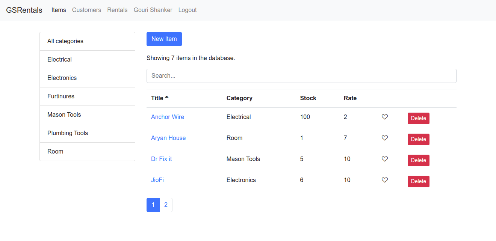
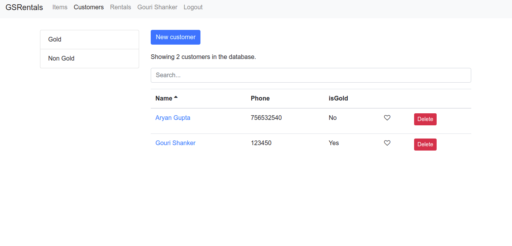
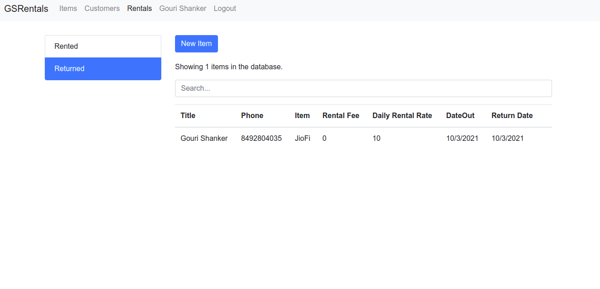

# Rental APP

## About

This is Full stack project made using react and nodejs.

## Preview

   

   

   

## How to Run the backend

You will have to follow some steps to run the API.

### 1 - Install MongoDB

To run this project, you need to install the latest version of MongoDB Community Edition first.

[https://docs.mongodb.com/manual/installation/](https://docs.mongodb.com/manual/installation/)

### 2 - Install Node.js

Download and install Node.js. Make sure to download and install the latest stable version (LTS).

[https://nodejs.org/en/download/](https://nodejs.org/en/download/)

### 2 - Install the API Dependencies

Open the project folder using the terminal or command prompt, then type the following:

`npm i`

The command above will install all node modules needed for the API to run. If you are using Linux or MacOS and receive a permission denied message, use `sudo`.

### 3 - Set the Environment Variables

You will have to set an environment variable to use as the secure key for JSON web tokens of the app. If you are using Linux or MacOS, run the following command:

`export vidly_jwtPrivateKey=SomeSecureKeyHere`
`export dbUrl=MongoDBURL`

### 4 - Running the Server

After following all steps above, you are ready to start the server. Type the following in the terminal or command prompt:

`node index.js`

This is going to run the application on port 3000. If this port is busy, the API will run in a different port. You can check the output to see in which port the API is running.

Navigate to [http://localhost:5000/api/genres](http://localhost:5000/api/genres). If everything is ok, you should receive a response like this:

```
{
  "success": true,
  "data": []
}
```

The API exposes the following REST routes:

```
/api/customers
/api/rentals
/api/returns
/api/users
/api/auth
```

### How to set up the frontend

## How to Run the backend

You will have to follow some steps to run the API.

### 1 - Install ReactJS

### 2 - Install the Dependencies

Open the project folder using the terminal or command prompt, then type the following:

`npm i`

The command above will install all node modules needed for the API to run. If you are using Linux or MacOS and receive a permission denied message, use `sudo`.

Now you are good to go.
